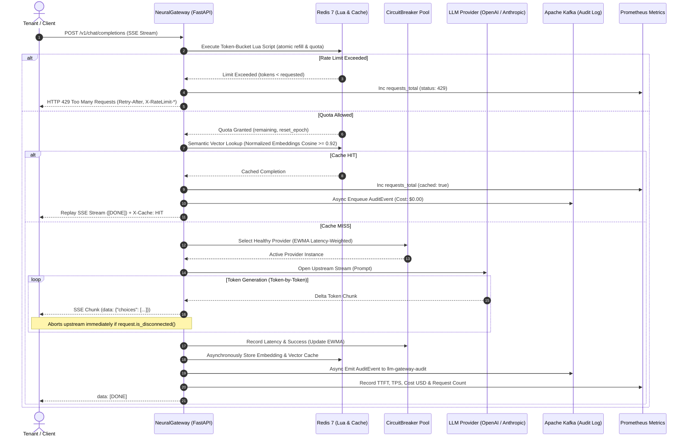

# NeuralGateway

[](https://every-spies-flow.loca.lt/docs)
[](https://www.python.org/)
[](https://fastapi.tiangolo.com/)
[](https://www.docker.com/)
[](https://redis.io/)
[](https://kafka.apache.org/)
[](https://prometheus.io/)
[](https://render.com/deploy?repo=https://github.com/Charanloyal/neural-gateway)

> ### 🌐 Active Live Demo Endpoints
> - **Interactive Swagger Docs**: [https://every-spies-flow.loca.lt/docs](https://every-spies-flow.loca.lt/docs) *(Local: [http://127.0.0.1:8000/docs](http://127.0.0.1:8000/docs))*
> - **Health & Cluster Status**: [https://every-spies-flow.loca.lt/healthz](https://every-spies-flow.loca.lt/healthz) *(Local: [http://127.0.0.1:8000/healthz](http://127.0.0.1:8000/healthz))*
> - **Prometheus Metrics**: [https://every-spies-flow.loca.lt/metrics](https://every-spies-flow.loca.lt/metrics) *(Local: [http://127.0.0.1:8000/metrics](http://127.0.0.1:8000/metrics))*
> - **Provider Status**: [https://every-spies-flow.loca.lt/v1/providers](https://every-spies-flow.loca.lt/v1/providers) *(Local: [http://127.0.0.1:8000/v1/providers](http://127.0.0.1:8000/v1/providers))*

**NeuralGateway** is an enterprise-grade, high-throughput, multi-tenant distributed LLM inference gateway engineered in Python. It provides atomic distributed rate-limiting via Redis Lua scripts, semantic vector caching with cosine similarity, dynamic latency-weighted routing with 3-state circuit breaking, non-blocking Kafka audit trails, and comprehensive Prometheus telemetry.

---

## Architecture & Request Lifecycle



---

## Key Platform Capabilities

1. **Distributed Atomic Rate Limiter**:
   - Single-roundtrip Lua script registered in Redis executing token-bucket refills, burst capacity checks, and quota deductions atomically.
   - Computes dynamic HTTP headers: `X-RateLimit-Limit`, `X-RateLimit-Remaining`, `X-RateLimit-Reset`, and `Retry-After`.

2. **Semantic Vector Caching**:
   - Computes unit-normalized L2 dense embeddings (`all-MiniLM-L6-v2` or deterministic dense vector projection fallback).
   - Redis-backed cosine similarity matching ($ \mathbf{u} \cdot \mathbf{v} \ge 0.92 $ threshold).
   - Replays cached responses over Server-Sent Events (SSE) immediately at zero LLM API cost.

3. **Dynamic EWMA Latency Routing & 3-State Circuit Breaker**:
   - Independent 3-state state machines (`CLOSED`, `OPEN`, `HALF_OPEN`) guarding each upstream provider.
   - Dynamically weights traffic using Exponentially Weighted Moving Average (EWMA) latency:
     $$\text{Weight}_i = \frac{1}{\text{EWMA}_i^{1.5}}$$
   - Detects client disconnections via `request.is_disconnected()` to immediately abort upstream LLM calls, saving compute and token budget.

4. **Kafka Audit Trail & Prometheus Telemetry**:
   - Non-blocking `AIOKafkaProducer` worker queue streaming structured audit records to topic `llm-gateway-audit`.
   - Native Prometheus scraping at `/metrics` exposing `llm_gateway_requests_total`, `llm_gateway_ttft_seconds`, `llm_gateway_tokens_per_second`, and `llm_gateway_cost_usd_total`.

---

## Directory Structure

```
neural-gateway/
├── app/
│   ├── __init__.py           # Package declaration
│   ├── config.py             # Typed Pydantic Settings & environment variables
│   ├── telemetry.py          # Prometheus gauges, histograms, counters
│   ├── circuit_breaker.py    # 3-state state machine with recovery timers
│   ├── router.py             # EWMA routing, ProviderPool, mock LLM engines
│   ├── rate_limiter.py       # Redis token bucket rate limiter via Lua
│   ├── cache.py              # Semantic vector cache with cosine similarity
│   ├── kafka_producer.py     # Non-blocking aiokafka audit event producer
│   └── main.py               # FastAPI lifespan, endpoints, SSE streaming
├── Dockerfile                # Multi-stage hardened build with unprivileged appuser
├── docker-compose.yml        # Orchestration (Gateway, Redis, Kafka, Zookeeper, Prometheus)
├── prometheus.yml            # Prometheus scrape configuration
├── requirements.txt          # Locked production dependencies
├── locustfile.py             # High-throughput benchmark test suite
└── README.md                 # System documentation & quickstart
```

---

## Quickstart with Docker Compose

Launch the full stack with automated healthchecks:

```bash
docker compose up -d --build
```

Verify service status:

```bash
docker compose ps
```

Verify health endpoints:

```bash
curl -s http://localhost:8000/healthz | jq .
```

Output:
```json
{
  "status": "healthy",
  "redis_connected": true,
  "kafka_connected": true,
  "providers_registered": 2
}
```

---

## Testing & Validation Commands

### 1. Server-Sent Events (SSE) Streaming Inference

```bash
curl -N -X POST http://localhost:8000/v1/chat/completions \
  -H "Content-Type: application/json" \
  -H "X-Tenant-ID: tenant-enterprise-01" \
  -d '{
    "model": "gpt-4o",
    "messages": [
      {"role": "user", "content": "Explain distributed vector caching"}
    ],
    "stream": true
  }'
```

Sample Stream Output:
```text
data: {"id": "chatcmpl-0bb68e77", "object": "chat.completion.chunk", "created": 1727389000, "model": "gpt-4o", "choices": [{"index": 0, "delta": {"content": "[openai-primary] "}, "finish_reason": null}]}

data: {"id": "chatcmpl-0bb68e77", "object": "chat.completion.chunk", "created": 1727389000, "model": "gpt-4o", "choices": [{"index": 0, "delta": {"content": "NeuralGateway "}, "finish_reason": null}]}

data: {"id": "chatcmpl-0bb68e77", "object": "chat.completion.chunk", "created": 1727389000, "model": "gpt-4o", "choices": [{"index": 0, "delta": {"content": "successfully "}, "finish_reason": null}]}

...
data: {"id": "chatcmpl-0bb68e77", "object": "chat.completion.chunk", "created": 1727389000, "model": "gpt-4o", "choices": [{"index": 0, "delta": {}, "finish_reason": "stop"}]}

data: [DONE]
```

### 2. Semantic Cache Hit Verification

Execute the exact or semantically similar query with response headers:

```bash
curl -i -N -X POST http://localhost:8000/v1/chat/completions \
  -H "Content-Type: application/json" \
  -H "X-Tenant-ID: tenant-enterprise-01" \
  -d '{
    "model": "gpt-4o",
    "messages": [
      {"role": "user", "content": "Explain distributed vector caching"}
    ],
    "stream": true
  }'
```

Notice the response headers:
```http
HTTP/1.1 200 OK
content-type: text/event-stream; charset=utf-8
x-cache: HIT
x-cache-similarity: 1.0000
```

### 3. Distributed Token Bucket Rate Limiting (HTTP 429)

Send rapid burst requests exceeding burst capacity:

```bash
for i in {1..250}; do
  curl -s -o /dev/null -w "%{http_code}\n" -X POST http://localhost:8000/v1/chat/completions \
    -H "Content-Type: application/json" \
    -H "X-Tenant-ID: tenant-burst-test" \
    -d '{"messages":[{"role":"user","content":"ping"}]}'
done
```

Sample HTTP 429 Response:
```http
HTTP/1.1 429 Too Many Requests
retry-after: 2
x-ratelimit-limit: 200
x-ratelimit-remaining: 0
x-ratelimit-reset: 2
content-type: application/json

{
  "error": {
    "message": "Rate limit burst exceeded. Retry in 1.9s.",
    "type": "tokens_per_second_quota_exceeded",
    "code": 429
  }
}
```

### 4. Circuit Breaker & Provider Health Diagnostics

Inspect real-time circuit breaker states and EWMA rolling latencies:

```bash
curl -s http://localhost:8000/v1/providers | jq .
```

Response:
```json
{
  "providers": {
    "openai-primary": {
      "name": "openai-primary",
      "circuit_state": "CLOSED",
      "ewma_latency_ms": 48.35,
      "consecutive_failures": 0,
      "retry_after_seconds": 0.0
    },
    "anthropic-secondary": {
      "name": "anthropic-secondary",
      "circuit_state": "CLOSED",
      "ewma_latency_ms": 74.12,
      "consecutive_failures": 0,
      "retry_after_seconds": 0.0
    }
  }
}
```

### 5. Prometheus Observability Metrics

Query scraped telemetry metrics:

```bash
curl -s http://localhost:8000/metrics | grep "llm_gateway"
```

Output:
```text
# HELP llm_gateway_requests_total Total count of LLM inference requests received by the gateway
# TYPE llm_gateway_requests_total counter
llm_gateway_requests_total{cached="false",provider="openai-primary",status="200",tenant="tenant-enterprise-01"} 14.0
llm_gateway_requests_total{cached="true",provider="cache",status="200",tenant="tenant-enterprise-01"} 8.0
llm_gateway_requests_total{cached="false",provider="none",status="429",tenant="tenant-burst-test"} 48.0

# HELP llm_gateway_ttft_seconds Time to first token (TTFT) in seconds for streaming inference
# TYPE llm_gateway_ttft_seconds histogram
llm_gateway_ttft_seconds_bucket{le="0.05",provider="openai-primary",tenant="tenant-enterprise-01"} 4.0
llm_gateway_ttft_seconds_bucket{le="0.1",provider="openai-primary",tenant="tenant-enterprise-01"} 14.0

# HELP llm_gateway_tokens_per_second Instantaneous generation speed in tokens per second
# TYPE llm_gateway_tokens_per_second gauge
llm_gateway_tokens_per_second{provider="openai-primary",tenant="tenant-enterprise-01"} 38.45

# HELP llm_gateway_cost_usd_total Accumulated estimated cost in USD based on input and output tokens
# TYPE llm_gateway_cost_usd_total counter
llm_gateway_cost_usd_total{provider="openai-primary",tenant="tenant-enterprise-01"} 0.000428
```

---

## Load Testing with Locust

Run high-concurrency benchmarks simulating multi-tenant workloads:

```bash
# Start Locust headless benchmark
locust -f locustfile.py --headless -u 100 -r 20 --run-time 1m --host http://localhost:8000
```
