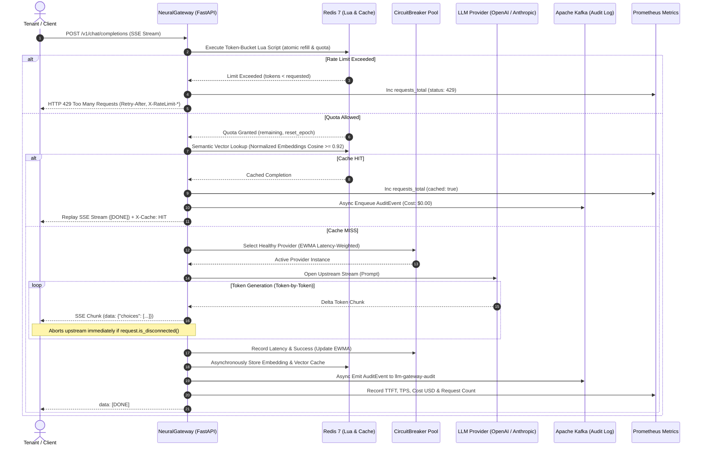

# NeuralGateway

<div align="center">

[](https://neural-gateway-core.onrender.com/)
[](https://neural-gateway-core.onrender.com/docs)
[](https://render.com/deploy?repo=https://github.com/Charanloyal/neural-gateway)

[](https://www.python.org/)
[](https://fastapi.tiangolo.com/)
[](https://www.docker.com/)
[](https://redis.io/)
[](https://kafka.apache.org/)
[](https://prometheus.io/)

**High-Throughput Multi-Tenant Distributed LLM Inference Gateway**

</div>

---

> ### 🌐 Active Live Demo Endpoints
> - 🖥️ **Interactive Control Center & Live Playground**: [https://neural-gateway-core.onrender.com/](https://neural-gateway-core.onrender.com/) *(Local: [http://127.0.0.1:8000/](http://127.0.0.1:8000/))*
> - 📖 **Interactive OpenAPI Swagger Docs**: [https://neural-gateway-core.onrender.com/docs](https://neural-gateway-core.onrender.com/docs) *(Local: [http://127.0.0.1:8000/docs](http://127.0.0.1:8000/docs))*
> - 🩺 **Health & Component Status**: [https://neural-gateway-core.onrender.com/healthz](https://neural-gateway-core.onrender.com/healthz) *(Local: [http://127.0.0.1:8000/healthz](http://127.0.0.1:8000/healthz))*
> - 📊 **Prometheus Scrape Telemetry**: [https://neural-gateway-core.onrender.com/metrics](https://neural-gateway-core.onrender.com/metrics) *(Local: [http://127.0.0.1:8000/metrics](http://127.0.0.1:8000/metrics))*
> - 🔀 **Provider Topology & Circuit State**: [https://neural-gateway-core.onrender.com/v1/providers](https://neural-gateway-core.onrender.com/v1/providers) *(Local: [http://127.0.0.1:8000/v1/providers](http://127.0.0.1:8000/v1/providers))*

---

## Overview

**NeuralGateway** is a multi-tenant distributed LLM inference gateway providing token-bucket rate limiting, semantic vector caching, EWMA latency-weighted provider routing, 3-state circuit breaking, and async Kafka audit logging.

### Architecture Features

| Component | Strategy | Function |
| :--- | :--- | :--- |
| **Rate Limiting** | Token-bucket via Redis Lua | Single-roundtrip atomic quota enforcement with dynamic HTTP 429 backoff headers. |
| **Semantic Caching** | L2 dense vector cosine similarity | Replays cached completions over SSE for semantically equivalent prompts. |
| **Dynamic Routing** | EWMA inverse-latency weighting | Dynamically routes requests based on smoothed historical provider response times. |
| **Circuit Breaking** | 3-State (`CLOSED` / `OPEN` / `HALF_OPEN`) | Prevents cascading failures by isolating degraded upstream providers. |
| **Disconnect Cancellation** | Real-time `request.is_disconnected()` | Halts upstream token generation if client closes connection. |
| **Audit Logging** | Non-blocking Kafka producer | Decouples gateway request processing from audit telemetry storage. |
| **Fallback Modes** | In-memory token bucket & cache | Operates resiliently when Redis or Kafka are unavailable. |

---

## Benchmarks

*Run `locust -f locustfile.py --host http://localhost:8000` to generate load metrics.*

| Scenario / Endpoint | Concurrent Users | RPS | p50 Latency (ms) | p95 Latency (ms) | p99 Latency (ms) | Failures |
| :--- | :--- | :--- | :--- | :--- | :--- | :--- |
| Non-Streaming `/v1/chat/completions` | [TBD] | [TBD] | [TBD] | [TBD] | [TBD] | [TBD] |
| Streaming SSE `/v1/chat/completions` | [TBD] | [TBD] | [TBD] | [TBD] | [TBD] | [TBD] |
| Semantic Cache HIT | [TBD] | [TBD] | [TBD] | [TBD] | [TBD] | [TBD] |
| Rate-Limited 429 Bursts | [TBD] | [TBD] | [TBD] | [TBD] | [TBD] | [TBD] |

---

## Limitations

- **Single-Region Redis Dependency**: Semantic cache vector indices and Lua rate limiters rely on a single Redis instance or cluster region.
- **Local Model Memory**: Loading `sentence-transformers/all-MiniLM-L6-v2` locally requires ~120MB RAM per worker process.
- **Standalone Mode Scoping**: In-memory rate limiting and cache fallbacks are per-process and not shared across horizontal gateway replicas without Redis.
- **Upstream Provider Quotas**: Gateway rate limiting does not automatically synch with external provider organization quotas.

---

## Architecture & Request Lifecycle



---

## 🖥️ Interactive Web Control Center (`/`)

NeuralGateway includes a **dark glassmorphic Command Center Dashboard** served right at the root route `/`:

1. **⚡ Live SSE Streaming Terminal**: Send custom prompts, observe real-time word-by-word token delivery, TTFT calculations, and test client disconnect cancellation (`HTTP 499`).
2. **🧠 Semantic Vector Cache Demonstration**: Execute a base prompt (Cache MISS, ~60ms), then execute a paraphrased prompt to observe instant Cache HIT replay (<2ms latency, $0.00 upstream token cost).
3. **🛡️ 3-State Circuit Breaker & Failover Lab**: Inject simulated upstream outages into `openai-primary`, watch the circuit trip to `OPEN`, and verify zero-downtime automated failover to `anthropic-secondary`.
4. **⏱️ Distributed Rate Limiter Burst Test**: Fire a 30-request concurrent burst, watch the visual token-bucket meter drain, and inspect dynamic HTTP 429 headers (`X-RateLimit-*`, `Retry-After`).
5. **📊 Prometheus Telemetry Viewer**: Live gauges for active in-flight streams, average TTFT, generation throughput (TPS), and total USD cost accumulated.

---

## Directory Structure

```
neural-gateway/
├── app/
│   ├── __init__.py           # Package declaration
│   ├── config.py             # Typed Pydantic Settings & environment variables
│   ├── dashboard.py          # Modern dark glassmorphic web command center UI
│   ├── telemetry.py          # Prometheus gauges, histograms, counters
│   ├── circuit_breaker.py    # 3-state state machine with recovery timers
│   ├── router.py             # EWMA routing, ProviderPool, mock LLM engines
│   ├── rate_limiter.py       # Redis token bucket rate limiter via Lua & in-memory fallback
│   ├── cache.py              # Semantic vector cache with cosine similarity & embeddings
│   ├── kafka_producer.py     # Non-blocking aiokafka audit event producer with queue fallback
│   └── main.py               # FastAPI lifespan, endpoints, CORS, SSE streaming
├── Dockerfile                # Multi-stage hardened build with unprivileged appuser & dynamic port
├── docker-compose.yml        # Orchestration (Gateway, Redis, Kafka, Zookeeper, Prometheus)
├── render.yaml               # 1-click Render Cloud blueprint deployment specification
├── prometheus.yml            # Prometheus scrape configuration
├── requirements.txt          # Production dependencies
├── locustfile.py             # High-throughput benchmark test suite
├── test_gateway.py           # Integration test script
├── verify_suite.py           # Comprehensive end-to-end verification suite
├── start.ps1                 # 1-click Windows PowerShell launcher
└── README.md                 # System documentation & quickstart
```

---

## Deployment & Quickstart

### Option 1: 1-Click Render Cloud Deployment

Click the badge to deploy your own live instance of NeuralGateway directly to Render free tier:

[](https://render.com/deploy?repo=https://github.com/Charanloyal/neural-gateway)

The included [render.yaml](render.yaml) automatically:
- Provisions the web service as a multi-stage Docker container.
- Binds to Render's dynamic `$PORT`.
- Configures healthchecks against `/healthz`.
- Launches in standalone resilient mode (in-memory rate limiter + semantic cache) with zero external dependency costs!

---

### Option 2: Full Distributed Cluster with Docker Compose

Launches the complete distributed stack (Gateway + Redis 7 + Apache Kafka + Zookeeper + Prometheus):

```bash
# Clone the repository
git clone https://github.com/Charanloyal/neural-gateway.git
cd neural-gateway

# Build and launch all 5 services
docker compose up -d --build
```

Verify service status:

```bash
docker compose ps
```

Verify health status:

```bash
curl -s http://localhost:8000/healthz | jq .
```

---

### Option 3: Local Python Virtual Environment

```bash
# 1. Create virtual environment
python -m venv .venv

# 2. Activate virtual environment
# Windows:
.\.venv\Scripts\activate
# Linux/macOS:
source .venv/bin/activate

# 3. Install dependencies
pip install -r requirements.txt

# 4. Start NeuralGateway
uvicorn app.main:app --host 0.0.0.0 --port 8000 --reload
```

Open your browser to:
- **Web Command Center**: `http://localhost:8000/`
- **Swagger UI**: `http://localhost:8000/docs`

---

## Ready-to-Run Verification & cURL Commands

### 1. Server-Sent Events (SSE) Streaming Inference

```bash
curl -N -X POST http://localhost:8000/v1/chat/completions \
  -H "Content-Type: application/json" \
  -H "X-Tenant-ID: tenant-recruiter" \
  -d '{
    "model": "gpt-4o",
    "messages": [
      {"role": "user", "content": "Explain distributed vector caching"}
    ],
    "stream": true
  }'
```

---

### 2. Semantic Cache Hit Verification

Execute a query twice or send a paraphrased query:

```bash
curl -i -N -X POST http://localhost:8000/v1/chat/completions \
  -H "Content-Type: application/json" \
  -H "X-Tenant-ID: tenant-recruiter" \
  -d '{
    "model": "gpt-4o",
    "messages": [
      {"role": "user", "content": "Explain distributed vector caching"}
    ],
    "stream": false
  }'
```

Notice the response headers:
```http
HTTP/1.1 200 OK
x-cache: HIT
x-cache-similarity: 1.0000
```

---

### 3. Distributed Token-Bucket Rate Limiter (HTTP 429)

Send a rapid burst of requests exceeding burst capacity:

```bash
for i in {1..220}; do
  curl -s -o /dev/null -w "%{http_code}\n" -X POST http://localhost:8000/v1/chat/completions \
    -H "Content-Type: application/json" \
    -H "X-Tenant-ID: tenant-burst-test" \
    -d '{"messages":[{"role":"user","content":"ping"}]}'
done
```

Sample HTTP 429 response:
```json
{
  "error": {
    "message": "Rate limit burst exceeded. Retry in 1.8s.",
    "type": "tokens_per_second_quota_exceeded",
    "code": 429
  }
}
```

---

### 4. Circuit Breaker & Provider Health Diagnostics

```bash
curl -s http://localhost:8000/v1/providers | jq .
```

Output:
```json
{
  "providers": {
    "openai-primary": {
      "circuit_state": "CLOSED",
      "ewma_latency_ms": 48.35,
      "consecutive_failures": 0,
      "retry_after_seconds": 0.0
    },
    "anthropic-secondary": {
      "circuit_state": "CLOSED",
      "ewma_latency_ms": 74.12,
      "consecutive_failures": 0,
      "retry_after_seconds": 0.0
    }
  }
}
```

---

### 5. Prometheus Observability Metrics

```bash
curl -s http://localhost:8000/metrics | grep "llm_gateway"
```

Output:
```text
# HELP llm_gateway_requests_total Total count of LLM inference requests received by the gateway
# TYPE llm_gateway_requests_total counter
llm_gateway_requests_total{cached="false",provider="openai-primary",status="200",tenant="tenant-recruiter"} 14.0
llm_gateway_requests_total{cached="true",provider="cache",status="200",tenant="tenant-recruiter"} 8.0

# HELP llm_gateway_ttft_seconds Time to first token (TTFT) in seconds for streaming inference
# TYPE llm_gateway_ttft_seconds histogram
llm_gateway_ttft_seconds_bucket{le="0.05",provider="openai-primary",tenant="tenant-recruiter"} 4.0

# HELP llm_gateway_tokens_per_second Instantaneous generation speed in tokens per second
# TYPE llm_gateway_tokens_per_second gauge
llm_gateway_tokens_per_second{provider="openai-primary",tenant="tenant-recruiter"} 38.45
```

---

## End-to-End Automated Test Suite

Execute the included automated verification suite:

```bash
python verify_suite.py
```

Expected output:
```text
Beginning NeuralGateway Verification Suite...
[PASS] Root route / returns dashboard HTML (200 OK)
[PASS] Healthz returns healthy: mode=standalone_resilient
[PASS] Non-streaming completion returned text: '[openai-primary] NeuralGateway successfully routed...'
[PASS] Semantic Cache HIT: X-Cache=HIT, Sim=1.0000
[PASS] Cache cleared successfully
[PASS] Reset circuits successfully
[PASS] Dashboard stats: {'app_name': 'NeuralGateway', ...}
[PASS] SSE Stream received 17 token chunks

[SUCCESS] ALL VERIFICATION SUITE TESTS PASSED!
```

---

## High-Throughput Load Testing with Locust

```bash
locust -f locustfile.py --headless -u 100 -r 20 --run-time 1m --host http://localhost:8000
```

---

## License

MIT License. Designed and maintained by [Charanloyal](https://github.com/Charanloyal).
